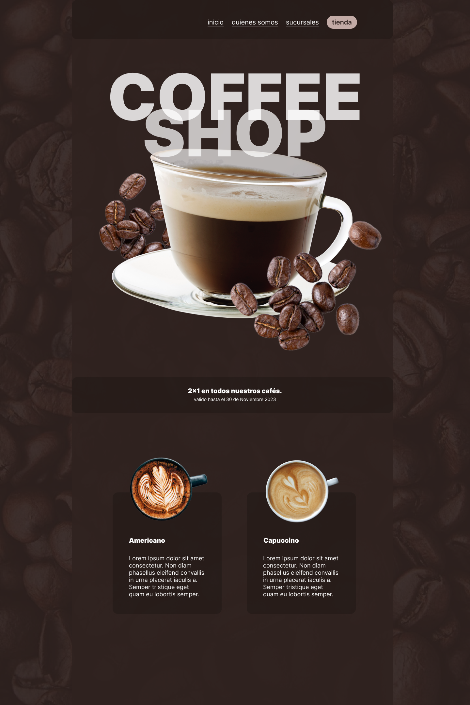

# Página con Positioning

Crea una página web basada en la imagen *mock.png* que se encuentra en esta misma carpeta.

Haz uso de la propiedad **position** en css, usando los valores:

- absolute,
- relative,
- fixed y
- sticky

En esta carpeta tienes el código base con algunos estilos y el HTML necesario. Solo agrega los estilos faltantes.